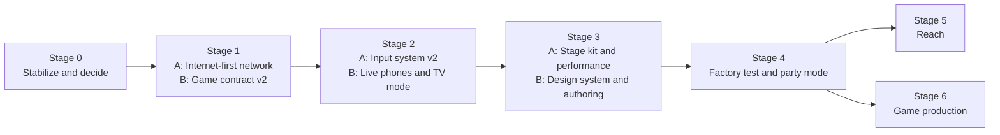
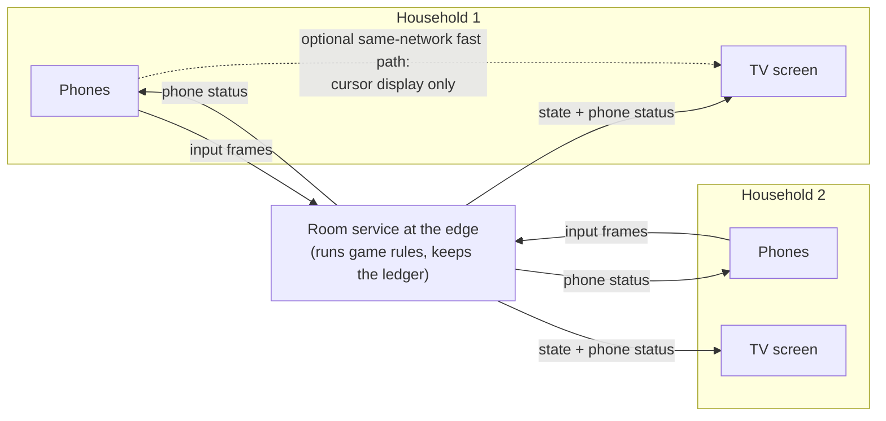

# Roadmap 2: from platform to game factory

Status: proposed, 2026-10-06. Audited against `develop` at `f16b540`.
This roadmap replaces nothing yet; [ROADMAP.md](ROADMAP.md) stays as it is.

## The goal

Controlla should reach a point where a new minigame is a brief, not a project.
Two developers write a one-page game brief, generate and build the game in its
own folder, and ship it. The game must look, feel and behave like every other
Controlla game, and it must play well over the internet.

"Done" for this roadmap means all of these are true on real devices:

1. **Self-contained.** A new game touches only its own folder plus one line in
   the game catalog. No edits to the shell, controls, networking or engine.
2. **Prompt-driven.** A game brief plus the `build-minigame` Claude skill
   produce a playable first version in the development harness.
3. **Internet-first.** Every game passes its playtest with phones on cellular
   data and players in different households. Feeling good on home Wi-Fi alone
   is a failure.
4. **Live phones.** Every phone shows that player's own status (score,
   cooldowns, turn, stun, secret role, choices) and reacts to the game with
   haptics, sound and changes to its controls.
5. **Defined inputs.** Every input a game can ask for, touch or motion, is a
   documented, configurable, reusable library input with a preview and tests.
6. **TV-first.** A TV opens one short URL and needs no mouse or keyboard after
   that. Phones join by scanning a QR code.
7. **One look.** Every game uses the shared rendering kit, palette, avatars,
   intro and results screens.
8. **Conformant.** Every game passes the automated conformance suite.

## Principles

These rules decide trade-offs at every stage.

- **The internet is the default network.** Design, measure and accept every
  feature under internet conditions. A same-network shortcut is an
  optimization layered on top, never the thing that makes it work.
- **Feel is measured.** Aim quality, input latency and frame rate have test
  tools and numeric targets. Tuning changes are compared against recorded
  traces, not judged by memory.
- **Games declare; the platform does.** A game states what it needs (inputs,
  length, teams, phone status, sounds). The platform supplies the phone UI,
  transport, timing, results and presentation. Games never ship phone code or
  network code.
- **Touch and motion are equals.** A motion input has the same definition,
  configuration, preview and test story as a button.
- **Phones are part of the game.** The phone is a second screen for each
  player, not a dumb pad.
- **Every game respects the session.** Games accept teams and stakes from the
  session, report placements, and end within a bounded time.

## Where we are today

The engine-side architecture is ahead of the product. The author contract,
controller library and motion core are strong. Hosting, phone feedback, the
TV experience, a shared visual standard and internet-grade networking are
missing.

### What works

| Area              | Today                                                                                                                                                                                                                                         |
| ----------------- | --------------------------------------------------------------------------------------------------------------------------------------------------------------------------------------------------------------------------------------------- |
| Game contract     | `GameDescriptor` in [api/index.ts](../src/client/api/index.ts): rules, renderer, state validation and controller requirements in one object. Registration is one line in [catalog.ts](../src/client/minigames/catalog.ts).                    |
| Authoring harness | `/dev/game-harness` runs a game with simulated players, no rooms or phones. Colocated game tests run in `npm run game:test`.                                                                                                                  |
| Touch controls    | Six library controls (`button`, `dpad`, `stick`, `aim-pad`, `swipe-pad`, `hold-meter`), each a folder with definition, gesture logic, view and styles. `npm run control:new` scaffolds one. Layout designer, gallery and phone preview exist. |
| Motion core       | Gyro "air mouse" pointer with soft dead zone, acceleration curve and gyro bias learning; gravity-corrected orientation; compass-anchored drift repayment; swing detection with aim lock; Motion Lab recording and trace replay.               |
| Session           | Placements convert to session points in a ledger with duplicate-safe round records.                                                                                                                                                           |
| Transport         | WebRTC data channels with a WebSocket relay fallback, clock sync, and a JSON session report with timing and loss statistics.                                                                                                                  |
| Quality           | 375 tests (374 pass; the one failure is caused by an untracked local `src/layouts/` folder). Typecheck and lint are clean. Production builds exclude developer tools.                                                                         |

### What is missing or wrong

| Area                 | Problem                                                                                                                                                                                                                                                                                                                                                                               |
| -------------------- | ------------------------------------------------------------------------------------------------------------------------------------------------------------------------------------------------------------------------------------------------------------------------------------------------------------------------------------------------------------------------------------- |
| Hosting              | Nothing is deployed. Play requires a laptop running two processes. Phones need trusted HTTPS for motion.                                                                                                                                                                                                                                                                              |
| Network model        | The host browser tab is the authority, so every remote player's input and every remote screen's state passes through one home connection. Phones reach their screen peer-to-peer, but only Google STUN is configured: no TURN, so many internet paths fall back to a WebSocket relay. If the host tab closes, the session ends.                                                       |
| Designed-in delay    | Presses wait 200 ms by default before they are judged. Snapshots go out every 40 ms as JSON, and the host's own TV holds the latest one without interpolating. All screens share a delay set by the worst screen's link, plus 90 ms.                                                                                                                                                  |
| Motion inputs        | `pointer`, `tilt`, `shake` and `chop` are hard-coded branches in [resolve.ts](../src/client/controls/resolve.ts) and [controller-input.ts](../src/client/runtime/controller-input/controller-input.ts). They have no definition files, no configurable props (the resolver strips them), no live gallery entry and fixed tuning. Only one motion vector can be active per controller. |
| Aim                  | The pointer is purely relative. Nothing ties the cursor to where the TV is, so the mapping drifts after edge clamps, slow turns and swing locks. Turning past an edge is thrown away. Three smoothing stages stack on the cursor path.                                                                                                                                                |
| Phones               | Phones receive their layout, the round phase and session points, never game state. They cannot show a score, cooldown, stun, turn, secret role or vote. iPhone Safari has no vibration API at all.                                                                                                                                                                                    |
| Round length         | Every round is a fixed `durationMs` timer. A game cannot end itself after a number of frames or turns, and there is no turn structure.                                                                                                                                                                                                                                                |
| Teams                | Outcomes are per-player placements only.                                                                                                                                                                                                                                                                                                                                              |
| Game-owned resources | Layouts live in a central folder and games refer to them by name. Sound cues are one global table in [sounds.ts](../src/client/runtime/browser/sounds.ts), including Whack-a-Mole's cues. There is no asset loading contract.                                                                                                                                                         |
| TV                   | The host screen is a web dashboard with a sidebar and a mouse-driven game picker. Joining needs a role choice, a 5-character room code, a 4-character screen code and a name.                                                                                                                                                                                                         |
| Look                 | Three visual languages (the lime "arcade" shell, the graphite controller, each game's own art). Neon Harvest draws with Canvas 2D; Whack-a-Mole draws with three.js and copies each frame into a 2D canvas. Countdown and results are plain text.                                                                                                                                     |
| Authoring            | No game scaffolder, no game brief format, no conformance suite beyond architecture tests, no bots.                                                                                                                                                                                                                                                                                    |

### Open branches that matter

| Branch                      | Contents                                                                                                            | Action                                                                  |
| --------------------------- | ------------------------------------------------------------------------------------------------------------------- | ----------------------------------------------------------------------- |
| `feature/one-link-join`     | One `/CODE` link per room, a QR code per screen, same-network screen auto-pick, screen emblems. Protocol version 5. | Phone-test, merge in Stage 0                                            |
| `codex/pointer-edge-memory` | Keeps up to 30° of turn past a screen edge so the center holds.                                                     | Phone-test, merge in Stage 0                                            |
| `docs/backlog`              | Backlog format and `BL-001`, a latency review brief.                                                                | Merge in Stage 0; the review feeds Stage 1                              |
| `codex/double-dash`         | Mario Kart: Double Dash emulation experiments, about 210 commits.                                                   | Park. A commercial game cannot ship, and it competes for the same time. |
| `feature/remote-pointer`    | Superseded pointer experiment.                                                                                      | Close                                                                   |

## How the work is split

Two lanes run in parallel inside each stage:

- **Lane A: hand to pixels.** Network, input, motion, rendering performance,
  devices.
- **Lane B: player and author.** Game contract, phone experience, TV
  experience, design system, authoring tools.

A stage ends when both lanes pass its gate. Items are sized S, M or L
relative to each other, so each lane carries a similar load per stage. Lane
assignments can swap if one person's strengths fit the other lane's work in a
given stage.



---

## Stage 0: Stabilize and decide

**Goal:** a clean `develop`, agreed decisions, and devices to test on.

- [ ] Agree or override each decision in [Decisions](#decisions). (S)
- [ ] Merge `docs/backlog`. (S)
- [ ] Phone-test and merge `feature/one-link-join`. (S)
- [ ] Phone-test and merge `codex/pointer-edge-memory`. (S)
- [ ] Park `codex/double-dash`; close `feature/remote-pointer`; delete local
      branches already merged. (S)
- [ ] Remove the untracked `src/layouts/` and the test layout so the suite is
      green; refresh the README, which still calls Neon Harvest the only game. (S)
- [ ] Draft the game brief template (see
      [The game standard](#the-game-standard)) so contract work in Stage 1
      builds toward it. (S)
- [ ] Assemble the device kit: an iPhone, an Android phone, a TV with Game
      Mode, and a phone plan with cellular data for internet tests. (S)

**Gate:** tests green on `develop`; every decision has a status; both people
can run a session on the device kit.

---

## Stage 1: Internet-first network and game contract v2

### Lane A: Internet-first network

**Goal:** a hosted service where a session feels good with phones on cellular
data and players in different households, measured by a repeatable harness.

#### Internet profiles

Every network feature is tested against named profiles. The numbers below
are starting points; adjust them from the first measurements.

| Profile         | Represents                                                 | Round trip to the service | Jitter | Loss |
| --------------- | ---------------------------------------------------------- | ------------------------- | ------ | ---- |
| `home`          | Phones and TV on the same Wi-Fi, reaching a nearby service | 20–40 ms                  | 5 ms   | 0%   |
| `cellular`      | Phones on mobile data in the same room as the TV           | 50–80 ms                  | 20 ms  | 1%   |
| `cross-country` | Players in two households in different states              | 80–120 ms                 | 15 ms  | 0.5% |
| `rough`         | Busy Wi-Fi or weak cellular signal                         | 60–100 ms                 | 40 ms  | 3%   |

#### Feel targets

These are the targets the network has to hit. They are proposals until the
measurement harness produces baselines.

| What the player experiences                                       | Target                                                                            |
| ----------------------------------------------------------------- | --------------------------------------------------------------------------------- |
| Phone feedback after a touch (visual, haptic, sound on the phone) | Immediate: under 30 ms, with no network in the path                               |
| Own cursor on the TV behind the hand                              | No more than the one-way network delay plus 50 ms; extrapolation hides part of it |
| Press to result visible on the TV                                 | No more than the round trip plus 80 ms                                            |
| Screens under `rough`                                             | Never freeze; at most a brief correction                                          |
| Two players acting at the same moment                             | Judged by when each acted, not by whose packet arrived first                      |

#### Target architecture

The recommended direction is an **authoritative room service at the edge**
that runs the same game code the host browser runs today.



Why this direction:

- **One hop for everyone.** Today a remote player's input goes phone → their
  screen → the host browser, and state comes back the same way. With an edge
  room, every device has one hop to a nearby server.
- **No home uplink in the middle.** The host's home connection stops being
  every remote player's bottleneck.
- **No NAT traversal on the main path.** Phones and screens make outbound
  connections to the service. Peer-to-peer and TURN become optional fast
  paths, not requirements.
- **Host loss stops ending the session.** A TV tab can reload and rejoin.
- **Games already fit.** Game rules (`GameInstance`) are plain TypeScript
  with no DOM, so the same code can run in a server runtime. Renderers stay in
  the browser.

The alternative is to keep host-browser authority and add TURN plus binary
snapshots. It costs less to build and keeps offline same-room play, but the
host's connection and tab stay single points of failure. The Stage 1
measurements decide between them (decision **D3**).

Techniques that apply whichever authority is chosen:

- **Immediate phone feedback.** Every press shows on the phone at once
  (visual, haptic where available, sound), before the network round trip.
- **Cursor extrapolation.** Screens draw each cursor from its latest input
  moved forward by its velocity over the measured one-way delay, capped. Input
  frames already carry velocity (`vx`, `vy`).
- **Lag-compensated judging.** The authority keeps a short history of game
  state. It judges a timestamped action against the world as the player saw
  it, instead of holding every press for 200 ms. Games choose their
  fairness window; the default drops to 60–80 ms.
- **Per-screen freshness.** Each screen interpolates with the smallest delay
  its own link allows, instead of all screens sharing a delay set by the worst
  link. Fairness between households comes from lag-compensated judging, not
  from equal delay (decision **D4**).
- **Compact state.** Binary delta snapshots at 30–60 Hz, with a size budget
  per game.
- **Redundant input.** Each input frame repeats the last few samples, so a
  lost packet doesn't lose a press or a cursor step.
- **Visible route.** The phone and TV show the connection quality in plain
  words ("Good", "Slow connection") instead of only in diagnostics.

#### Lane A work items

- [ ] **Network harness. (M)** Runs the real engine, routing and playback code
      over a simulated transport with each internet profile. Reports stage-by-stage
      latency for cursor, press-to-result and remote screens. Also add a
      development switch that runs the local dev server under a profile, for
      example `npm run dev -- --net=cellular`, so daily work happens under
      internet conditions. The `BL-001` brief on `docs/backlog` describes the
      measurement half in detail.
- [ ] **Quick wins in the current model. (S)** Snapshots every tick for the
      host's own screen; default press window 80 ms; screen-side cursor
      extrapolation.
- [ ] **Choose the authority model (D3). (S)** Use harness numbers for
      both options under all four profiles.
- [ ] **Hosted deployment. (L)** Static app plus room service on the chosen
      provider, with HTTPS and a short domain. Add TURN if any path stays
      peer-to-peer. Rooms and resume tokens move from the in-memory Node process
      to the hosted service.
- [ ] **Authority move, if D3 picks the edge. (L)** Run `GameInstance` in the
      room service; phones and screens become clients of it; the ledger lives
      with the room. Keep the game author API unchanged.
- [ ] **Lag-compensated judging and per-screen freshness. (M)**
- [ ] **Binary delta snapshots and redundant input frames. (M)**
- [ ] **Android Chrome pass. (S)** Everything so far was tested on one iPhone 13.

### Lane B: Game contract v2

**Goal:** the author API can express every game on the idea list without
edits outside the game folder. This lane defines the contracts and the engine
support. Stage 2 builds the phone and TV experiences on top of them.

#### Game-defined length

Many games end when play ends, not on a timer. Bowling plays 3–5 frames;
a race ends when the last player crosses the line; a last-one-standing game
ends when one player remains.

```ts
type RoundLength =
  | { kind: 'timed'; ms: number }
  // The game ends itself; maxMs is a safety cap that ends the round on the
  // current standings if the game never finishes.
  | { kind: 'until-done'; maxMs: number };
```

- The game ends an `until-done` round by returning `{ done: true }` from
  `tick`, or through a `finish()` call on its context. The framework then runs
  its usual settle, finalize and results steps.
- The game publishes a short **progress label** with its state, such as
  "Frame 2 of 4" or "3 players left". The TV HUD and every phone show it.
- The countdown, practice and results phases stay framework-owned.

#### Turns

Bowling, golf and darts are turn-based; most other games are simultaneous.

```ts
type TurnMode = 'simultaneous' | 'sequential';
```

- In `sequential` mode the game names the active player (or team). The
  framework routes only the active player's actions to the game and tells
  every phone whose turn it is, so phones can show "Your turn" or "Up next:
  Bea".
- A turn may carry a shot clock. When the clock runs out, the game decides
  what happens (skip, auto-play, foul).
- Inactive players' phones can stay live for side actions the game declares,
  such as cheering or heckling.

#### Teams and formats

- Games declare the formats they support: `ffa`, `teams-2v2`, `1vN`, `coop`.
- The session picks the format and the team split and passes it in
  `GameContext.teams`. Games never invent teams themselves.
- Outcomes gain a team result, and the session's point policy decides how team
  results become session points.

#### Phone status: the game talks to each phone

Every phone must be able to show its own player's state and react to the game.
This is a required part of the contract, not an add-on.

```ts
interface GameDescriptor<S> {
  // ...existing fields...
  /** Called by the authority at a low rate and on change, once per player. */
  phoneView?(state: S, playerId: string): PhoneView;
}

interface PhoneView {
  status?: { text: string; tone?: 'neutral' | 'good' | 'warning' | 'bad' };
  score?: number;
  progress?: string; // "Frame 2 of 4"
  turn?: 'yours' | 'waiting' | 'none';
  meters?: { id: string; label: string; value: number; max: number }[];
  /** Readiness as authority timestamps; the phone counts down locally. */
  cooldowns?: { action: string; readyAt: number }[];
  /** Actions that are greyed out right now, e.g. while stunned. */
  disabled?: string[];
  /** Switch to another layout the game ships, e.g. "aim" → "throw". */
  layout?: string;
  /** A full-screen panel instead of, or over, the controls. */
  panel?: PhonePanel;
}

type PhonePanel =
  | { kind: 'message'; title: string; body?: string }
  | { kind: 'reveal'; title: string; body: string } // secret role or card
  | { kind: 'choice'; prompt: string; options: { id: string; label: string }[] }
  | { kind: 'vote'; prompt: string; candidates: string[] } // player ids
  | { kind: 'text'; prompt: string; maxLength: number };
```

- **Private by construction.** Each phone receives only its own view. A secret
  role never reaches another player's phone or any screen.
- **Answers are input.** A choice, vote or text answer from a panel arrives at
  the game as an ordinary action with a value.
- **Phone reactions.** Presentation events that name a player can carry a
  phone reaction: a haptic pattern (`tap`, `thud`, `buzz`, `success`), a sound
  the game ships, or a colour flash. iPhones without web haptics play the
  sound or flash instead.
- **Safe under the internet.** Views are small (size-checked), stamped with
  round, configuration generation and sequence, and stale ones are dropped.
  They refresh on reconnect and phase changes. Cooldowns are sent as authority
  timestamps and counted down on the phone with the synced clock, so they stay
  smooth over a slow link.
- **The authority stays in charge.** A phone may grey out a button on its own
  countdown, but only the authority accepts or rejects the action.

#### Game-owned resources and phases

- **Layouts in the game folder.** A game ships its layouts as JSON next to its
  code, including named alternates for `phoneView.layout` and per-role
  layouts. The central layout folder keeps only shared templates.
- **Sounds and music.** Games ship their own sound files and name them in
  presentation events. Built-in synthesized cues remain as a fallback.
- **Assets.** A declared asset manifest that the screen preloads before the
  countdown, with a fallback when an asset fails. Assets never enter game state.
- **Practice and ready-up.** An optional phase before the countdown: players
  try the controls with no scoring and press Ready on the phone.
- **Themed intro and results.** Games provide title art and accent colours
  through the descriptor; the framework draws the intro, countdown and podium.
- **Tags.** Descriptors declare their formats and input family (see
  [Categories](#categories)) so the session can pick fair, varied games.

#### Lane B work items

- [ ] **Game-defined length, progress label and safety cap. (M)**
- [ ] **Turn mode with active-player routing and shot clock. (M)**
- [ ] **Teams and formats in context, outcomes and the point policy. (M)**
- [ ] **`phoneView` contract, validation, per-player routing and reconnect
      refresh. (M)** Rendering on the phone is Stage 2.
- [ ] **Phone reactions on presentation events. (S)**
- [ ] **Game-owned layouts, sounds and asset manifest. (M)**
- [ ] **Practice and ready-up phase. (S)**
- [ ] **Descriptor tags and themed intro and results data. (S)**
- [ ] **Contract examples.** A test-only Bowling-shaped game (sequential
      turns, until-done, frames) and a hidden-role game (reveal and vote panels)
      prove the contract in the harness. (S)

### Stage 1 gate

- The hosted service runs a full session with phones on cellular data and a
  second household, with no laptop running local processes.
- The network harness reports all four profiles, and the quick wins measurably
  cut press-to-result and cursor delay.
- D3 and D4 are decided from measurements.
- The two contract example games run in the harness: one ends after its
  frames with turns routed correctly, one shows private roles and collects
  votes.

---

## Stage 2: Input system v2, live phones and TV mode

### Lane A: Input system v2

**Goal:** every input a game can ask for, touch or motion, is a defined,
configurable, reusable library input. Aim feels anchored to the TV.

#### Motion inputs become library inputs

Each motion input gets a folder shaped like the touch controls:

```
src/client/controls/<type>/
  definition.ts   pure data: type, output kind, channel, sensors needed,
                  defaults, editable fields, fallback kinds, calibration needs
  provider.ts     pure processing: motion samples in, values and presses out;
                  replayable against recorded traces
  Preview.tsx     live visual for the gallery, designer and phone preview
  provider.test.ts  tests against recorded Motion Lab traces
```

```ts
interface MotionInputDefinition<P extends object> {
  type: string; // 'pointer', 'tilt', 'shake', 'chop', 'jolt', ...
  displayName: string;
  description: string;
  kind: OutputKind; // 'vector', 'press', ...
  channel: Channel; // 'value', 'press', 'both'
  sensors: ('gyro' | 'accel' | 'compass')[];
  defaults: P; // gain, bounds, thresholds, ...
  fields: readonly Field[]; // editable in the designer
  /** Touch output kinds that may stand in when motion is unavailable. */
  fallbackKinds: readonly OutputKind[];
  /** Whether the phone shows Recenter or a level step for this input. */
  calibration: 'recenter' | 'level' | null;
  create(props: P): MotionProvider;
}

interface MotionProvider {
  sample(sample: MotionSample): MotionOutput | null;
  press?(down: boolean, at: number): void; // for inputs that combine a button
  recenter?(): void;
  reset(): void;
}
```

What changes:

- Games configure motion inputs with props exactly like touch inputs, for
  example `pointer` with `{ gain, bounds, profile: 'precise' }` or `shake`
  with `{ thresholdG }`. Today the resolver strips motion props.
- The hard-coded motion branches leave `resolve.ts` (availability, sensor
  flags) and `controller-input.ts` (shake, chop, pointer, tilt loops). The
  runtime iterates over the resolved providers instead.
- Motion inputs appear live in the gallery on a phone, with a readout of what
  the game receives, the same as touch controls. Designer tiles stop being
  placeholders.
- `npm run control:new -- <type> --motion` scaffolds a motion input.
- Swing logic (aim lock while a button is held, rebound suppression) becomes a
  provider composed with `pointer`, not special code in the runtime.

#### Input wire v2

The current 47-byte input frame carries one coordinate pair and four press
slots, so a controller can use only one motion vector. Some planned games
need more: a kart that steers by tilt and aims items with the pointer, or
bowling with aim and a separate swing.

- The resolved configuration lists continuous channels and press actions by
  index.
- Each frame carries a compact value per continuous channel (quantized) and up
  to eight press slots, plus the last few samples for redundancy (Stage 1).
- Touch values that change often (sticks, aim pads) move onto the same frame,
  so they're no longer throttled JSON on the reliable channel.
- The protocol version gate covers the change. Stage 5 adds
  backward compatibility before any native app or TV app ships.

#### New motion inputs

| Input   | Senses                                                    | Game receives                                                  | Needed by                                      |
| ------- | --------------------------------------------------------- | -------------------------------------------------------------- | ---------------------------------------------- |
| `jolt`  | A sharp flick in a direction                              | Direction and strength, one press per flick                    | Showdown Chop, Chop Shop, Don't Spill the Milk |
| `swing` | An arm swing with a release (button let go or wrist snap) | Release speed, direction and timing, as one press with a value | Bowling, Golf, Darts                           |
| `twist` | Rotation around the phone's long axis                     | Angle, like a steering wheel                                   | Kart Racer, Tilt Rally                         |

#### Aim anchored to the TV

The pointer moves the cursor by how fast the phone turns. Nothing ties the
cursor to where the TV is, so the mapping slowly drifts. These changes fix
that:

1. **Recenter at every countdown.** The countdown says "Point at the screen";
   at GO, each phone that is holding steady recenters itself.
2. **Absolute vertical aim.** Gravity gives the phone's pitch with no drift.
   Map cursor height from pitch relative to a calibrated center instead of
   integrating turn speed.
3. **Remembered TV direction.** On joining, each player points at the TV and
   taps once. Store that compass-anchored heading for the player and screen.
   The existing drift correction (`AimLedger`) then pulls the cursor toward
   the TV's real direction instead of toward where the cursor has been. It
   still corrects only while the hand moves, so a still cursor never slides.
4. **Compass fallback.** When the compass is unreliable (rated worse than 30°,
   or bent by a metal TV stand), fall back to relative aim plus countdown
   recentering, and say so in diagnostics.
5. **Off-screen tracking.** Turning past an edge is remembered (the
   `codex/pointer-edge-memory` change), the TV draws an arrow in the player's
   colour at the edge while the aim is off screen, and the game receives an
   `offscreen` flag with the sample.
6. **One smoothing stage.** Today the phone smoother, the screen's local-cursor
   smoother and Whack-a-Mole's own glide all stack. Keep only the phone
   smoother and add screen-side extrapolation (Stage 1).
7. **Aim profiles.** `precise` (darts, small targets) and `sweep` (large
   fields) tune gain and acceleration per game.

#### Aim test

Motion Lab gains an aim test: targets appear around the screen, and the test
records time to acquire, overshoot, and how far the cursor sits from the
true direction after several minutes of play. It runs live on a phone and
against recorded traces, so every tuning change is compared with the last.

#### Other sensors

| Sensor                                | Browser access                  | Use                                                           | Plan                               |
| ------------------------------------- | ------------------------------- | ------------------------------------------------------------- | ---------------------------------- |
| Phone speaker                         | Yes, after a tap                | Private per-player cues; stands in for missing iPhone haptics | Phone reactions (Stage 1)          |
| Microphone                            | Yes, with permission            | Blow, shout or sing inputs                                    | Library input when a game needs it |
| Camera                                | Yes, with permission            | Selfie avatar at join                                         | Stage 2, Lane B                    |
| Vibration                             | Android only; not iPhone Safari | Haptics                                                       | Native controller study (Stage 5)  |
| Barometer, proximity, light, NFC, UWB | Not in iPhone browsers          | —                                                             | Skip                               |

#### Lane A work items

- [ ] **Motion input definition contract, provider runtime and scaffolder. (L)**
- [ ] **Port `pointer`, `tilt`, `shake` and `chop` to library inputs with
      trace tests and live gallery previews. (M)**
- [ ] **Port the remaining legacy touch inputs (`slider`, `dial`, `text`,
      `draw-canvas`) to the library. (M)**
- [ ] **Input wire v2. (M)**
- [ ] **Aim test in Motion Lab. (S)**
- [ ] **Countdown recenter, absolute pitch, remembered TV direction, compass
      fallback. (M)**
- [ ] **Off-screen arrow and `offscreen` flag; single smoothing stage; aim
      profiles. (S)**
- [ ] **`jolt`, `swing` and `twist` inputs. (M)**

### Lane B: Live phones and TV mode

**Goal:** phones show each player's game, and a TV runs a whole party from one
URL with no mouse or keyboard.

#### The live phone

- Render every `PhoneView` field: a status strip above the controls, score
  and progress, turn banner, meters, cooldown rings on the matching buttons,
  greyed-out disabled actions, layout switches without remounting controls,
  and full-screen panels for message, reveal, choice, vote and text.
- Panels and status follow the controller design guide
  ([CONTROLLER-DESIGN.md](design/CONTROLLER-DESIGN.md)) and work in both
  orientations.
- Phone reactions play immediately when they arrive; presses also get
  immediate local feedback without waiting for the network.

#### TV mode: how a TV gets the game

A TV has no keyboard or mouse, and typing with a remote is slow, so the TV
should only ever need to open one short address once.

**What `/tv` is.** `/tv` is a page on the hosted site (for example
`controlla.app/tv`) that turns any screen into a room's TV with no further
input:

1. On load it creates a room and shows a large room code, a QR code and the
   short join address (`controlla.app/K7QMX`).
2. Phones scan the QR code or type the address. Players appear on the TV with
   their colour and avatar as they join.
3. The first phone to join becomes the **party leader**. The leader picks
   games, starts the party and can hand leadership to someone else. Nothing is
   clicked on the TV.
4. The page asks for fullscreen on the first remote or key press (browsers
   need one gesture) and keeps the screen awake.
5. If the page reloads, it rejoins the same room.

A second household opens the same `/tv` address and joins the existing room
from a phone ("Add this screen to my party"), or opens `controlla.app/K7QMX`
directly.

**How each kind of TV reaches `/tv`:**

| TV setup                          | How it opens `/tv`                                                                    | Notes                                                                                                                     |
| --------------------------------- | ------------------------------------------------------------------------------------- | ------------------------------------------------------------------------------------------------------------------------- |
| Laptop or PC connected by HDMI    | Open the address in a browser and drag the window to the TV                           | Works today once hosted. Extend the desktop rather than mirroring it, and use the TV's Game Mode.                         |
| Smart TV with a built-in browser  | Type the short address once with the remote, then bookmark it                         | Browser quality varies by brand and year; test Samsung and LG models before promising support.                            |
| Google TV, Android TV, Fire TV    | Install the Controlla TV app once; it opens straight into TV mode                     | A thin wrapper around `/tv`. The most reliable route after HDMI. Stage 5.                                                 |
| Chromecast with a custom receiver | Tap Cast in Chrome on a laptop or an Android phone; the Chromecast loads `/tv` itself | No video is streamed, so latency matches a normal screen. iPhone Safari can't start a cast. Needs a spike first. Stage 5. |
| AirPlay or tab mirroring          | Not supported for play                                                                | Mirroring streams video, which adds too much delay for action games.                                                      |
| Apple TV                          | Not supported                                                                         | tvOS has no web runtime.                                                                                                  |

**The TV screen itself:**

- A 10-foot layout: large type, a 5% safe margin for TV overscan, text at
  least 28 logical pixels on the 1600×900 canvas.
- Diagnostics move behind a hidden toggle; the current dashboard stays for
  development.
- A 20-second display check on first use: players tap along to a flashing
  beat, and the TV stores its measured display delay. Rhythm games correct
  for it, and the TV suggests Game Mode when the delay is high.

#### Joining and identity

- Build on `feature/one-link-join`: one link per room, a QR code per screen,
  and the right screen picked automatically.
- On first join, a phone picks a name and an avatar (optionally a selfie), and
  remembers them for next time.
- A guided first minute covers motion permission, the point-at-the-TV step
  and a short practice.

#### Lane B work items

- [ ] **Phone rendering of status, meters, cooldowns, disabled actions and
      layout switches. (M)**
- [ ] **Phone panels: message, reveal, choice, vote, text. (M)**
- [ ] **`/tv` mode with auto room, QR, party leader and phone-driven game
      selection. (L)**
- [ ] **Names and avatars, remembered per phone; guided first minute. (M)**
- [ ] **Display delay check. (S)**

### Stage 2 gate

- Every input in the input glossary, touch and motion, has a definition, live
  gallery preview and tests. No motion type is named in the resolver or the
  phone input loop.
- After 10 minutes of play under the `cellular` profile, the cursor still
  lines up with where the phone points, without anyone pressing Recenter. The
  aim test's numbers set the exact threshold.
- A full party runs from a TV that only opened `/tv`, with phones joined by
  QR code under the `cellular` profile.
- The contract example games show live status, private roles, votes and turn
  banners on real phones.

---

## Stage 3: The standard

**Goal:** one rendering kit, one design system and one authoring path, so
every game looks related and a new game starts from a scaffold.

### Lane A: Stage kit and performance

- [ ] **three.js stage kit. (L)** One 16:9 camera rig, shared toon lighting
      and materials, the house palette, particle effects, player avatar models,
      an asset loader using the Stage 1 manifest, and an HTML overlay for crisp
      HUD text. Renders straight to the screen canvas (no copying into a 2D
      canvas). Canvas 2D stays allowed for prototypes only.
- [ ] **Performance budget. (M)** 60 frames per second with 8 players on a 2020
      laptop and on Android TV-class hardware. The harness reports frame time
      per game.
- [ ] **Simulation off the render thread. (S)** Wherever a browser still runs
      game rules (development harness, or the host if D3 keeps host
      authority), they run in a Web Worker.
- [ ] **Port Whack-a-Mole to the kit. (M)**

### Lane B: Design system and authoring

- [ ] **Design system. (M)** One set of tokens and components shared by the TV
      shell, phone shell, phone panels and game HUDs, in the house style chosen
      in D6. Themed intro, countdown, results and podium.
- [ ] **Game scaffolder. (M)** `npm run game:new <id>` creates a game folder
      with descriptor, model, rules, a renderer on the stage kit, a layout, a
      sound list, a simple bot and tests.
- [ ] **Bots. (S)** Each game ships a simple bot for testing, odd team sizes
      and the conformance suite.
- [ ] **Conformance suite. (M)** Described under
      [The game standard](#the-game-standard).
- [ ] **Game standard document and `build-minigame` skill. (M)** The skill
      takes a brief, scaffolds, builds on the kit, runs conformance and opens
      the harness.

### Stage 3 gate

- Whack-a-Mole runs on the stage kit, passes conformance and meets the frame
  budget.
- `npm run game:new` produces a game that passes conformance before any
  game-specific code is written.

---

## Stage 4: Factory test and party mode

**Goal:** prove that a new game needs nothing outside its folder.

- [ ] **Lane A builds Bowling** from a brief using only the skill and its game
      folder. It exercises `swing`, sequential turns, a frame-based length and
      phone status ("Your turn", pins left).
- [ ] **Lane B builds Bomb Squad** the same way. It exercises phone panels,
      roles with private information, `dial` and `text` inputs, and a
      cooperative format.
- [ ] **Both** keep a log of every edit made outside the game folder, and fix
      the contract or kit that forced it before the gate.
- [ ] **Lane B: party playlist.** The party leader picks a playlist of 5–10
      games; the session runs them back to back with running points, and ends
      on a podium with bonus awards.
- [ ] **Lane A: internet playtest of both games** under all four profiles.

**Gate:** both games ship with zero edits outside their folders plus one
catalog line each, pass conformance, and pass the internet playtest.

---

## Stage 5: Reach

**Goal:** more ways onto TVs and phones, without breaking web-first play.
Runs alongside Stage 6.

- [ ] **Protocol backward compatibility. (M)** Installed apps lag web
      releases, so the service must accept the previous protocol version.
- [ ] **Google TV, Android TV and Fire TV app. (M)** A thin wrapper that opens
      `/tv` fullscreen.
- [ ] **Chromecast receiver spike. (S)** Does a custom receiver run `/tv` with
      its network connection and frame budget? Go or no-go.
- [ ] **Native controller study. (M)** Wrap the same controller page in a
      native shell (for example Capacitor). Bridge motion sensors and haptics
      through the existing injectable interfaces (`MotionEnvironment` and the
      haptic effect), then compare it with the browser using the aim test.
      Ship only if it clearly wins. If it ships, it is optional ("get haptics"),
      followed by an App Clip that opens from the TV's QR code.
- [ ] **Production telemetry and crash reporting. (S)**

### Should the controller be a native app?

The browser stays the default controller: installing anything kills party
momentum, and the closest products (Jackbox, AirConsole) work with no
install. A native app is only worth it as an optional upgrade:

| Benefit     | Mobile browser                                                         | Native app                                                                         |
| ----------- | ---------------------------------------------------------------------- | ---------------------------------------------------------------------------------- |
| Haptics     | None on iPhone; basic on Android                                       | Rich haptic patterns on both                                                       |
| Motion data | About 60 Hz on iPhone; a permission tap each session; smoothed compass | Higher sample rates, fused attitude referenced to magnetic north, no motion prompt |
| Fullscreen  | Not possible in iPhone Safari                                          | True fullscreen and orientation lock                                               |
| Joining     | QR opens the web link                                                  | App Clip opens from a QR code with no full install                                 |
| Networking  | WebRTC and WebSocket                                                   | Same, plus local discovery; the network is not the main delay                      |
| Cost        | None                                                                   | Store accounts, review cycles, two platforms, version skew                         |

The screen stays in the browser in every case.

---

## Stage 6: Game production

**Goal:** a steady flow of games. Starts after the Stage 4 gate.

Split games by input family, so each person deepens one set of controls and
keeps a consistent feel within it:

- **Lane A:** aim, swing and steer games (Target Practice, Darts, Golf, Kart
  Racer, Don't Spill the Milk, Honey Hustle restyle of Neon Harvest).
- **Lane B:** touch, rhythm, and word and draw games (Brawl, Basketball,
  Saber Slash, Jam Session, Shape Flash).

Every game follows the same path: brief, skill, harness, phone playtest under
`cellular`, conformance, merge. Record new ideas with the `add-minigame-idea`
skill in [MINIGAMES.md](MINIGAMES.md).

---

## The game standard

The standard is what lets a brief, rather than a long explanation, define a
game.

### Reference products

| Product                   | What to copy                                                                                                                                                        |
| ------------------------- | ------------------------------------------------------------------------------------------------------------------------------------------------------------------- |
| Mario Party               | One rules screen with a control diagram; a practice round with ready-up; team formats (free-for-all, 1v3, 2v2); short games; one character roster across every game |
| Jackbox                   | No install; a room code on the TV; private information on each phone                                                                                                |
| AirConsole                | Browser phone controllers for TVs, optional phone apps, an Android TV app, a developer SDK; the closest product to Controlla                                        |
| Wii Sports, Switch Sports | One real-world gesture per game; aim tied to the TV                                                                                                                 |
| WarioWare                 | One-verb prompts ("Whack!") and consistent framing between games                                                                                                    |

### Game brief template

Every game starts as a brief with these fields:

| Field           | Content                                                                                                                                                          |
| --------------- | ---------------------------------------------------------------------------------------------------------------------------------------------------------------- |
| Name and pitch  | One sentence                                                                                                                                                     |
| Format          | `ffa`, `teams-2v2`, `1vN` or `coop`; player range                                                                                                                |
| Input family    | Aim, steer, swing, touch, rhythm, or word and draw                                                                                                               |
| Inputs          | Library input names and props, with fallbacks                                                                                                                    |
| Length          | `timed` (seconds) or `until-done` (frames, turns or condition, plus the safety cap); target 30–90 seconds of play for timed games, and a similar feel for others |
| Turns           | `simultaneous` or `sequential`                                                                                                                                   |
| Win and scoring | How placement is decided                                                                                                                                         |
| Rules           | At most three lines, as shown before the round                                                                                                                   |
| Phone view      | What each phone shows and when                                                                                                                                   |
| Phone reactions | Haptic, sound or flash per event                                                                                                                                 |
| Sounds          | Cue list                                                                                                                                                         |
| Art note        | Scene, objects and accents within the house palette                                                                                                              |

### Engine and graphics

| Option                           | Strength                                                        | Weakness                                                        |
| -------------------------------- | --------------------------------------------------------------- | --------------------------------------------------------------- |
| three.js with a shared stage kit | Already used by Whack-a-Mole; a 3D toon look reads well on a TV | Needs the kit and an asset pipeline                             |
| Canvas 2D with sprite art        | Cheapest                                                        | Looks flat on a TV; every game rebuilds effects                 |
| PixiJS                           | Fast 2D on WebGL                                                | A second stack beside three.js                                  |
| Phaser                           | Full 2D framework                                               | Wants to own the game loop, which fights authority-driven state |
| Unity or Godot web export        | Big toolsets                                                    | Large downloads, weak on TV hardware, breaks the game contract  |

Recommendation: three.js through the shared stage kit (decision D5).

### Categories

Games are tagged on two axes: **format** (free-for-all, 2v2, 1vN, co-op) and
**input family**. The party playlist uses the tags to keep a session varied
and fair, and to skip motion games for players whose phones are touch-only.

| Input family  | Games (built in bold)                                      |
| ------------- | ---------------------------------------------------------- |
| Aim           | **Whack-a-Mole**, **Neon Harvest**, Target Practice, Darts |
| Steer         | Kart Racer, Tilt Rally, Don't Spill the Milk               |
| Swing         | Bowling, Golf, Showdown Chop, Chop Shop                    |
| Touch         | Brawl, Basketball                                          |
| Rhythm        | Jam Session, Saber Slash                                   |
| Word and draw | Shape Flash, Bomb Squad                                    |

### Conformance suite

Every game must pass, automatically:

- Runs with bots at 1, 2 and 8 players (or its declared range) and in each
  format it declares.
- Survives a player disconnecting and reconnecting mid-round.
- Ends cleanly: timed games at their time, `until-done` games by themselves or
  at the safety cap.
- Returns valid placements, and team results for team formats.
- Stays under the snapshot size budget and the frame-time budget.
- Resolves a controller on a touch-only phone (every motion input has a touch
  fallback).
- Produces a `phoneView` within the size limit for every player, and never
  leaks one player's private panel to another.
- Has rules of three lines or fewer and a practice behaviour.
- Plays its internet-profile replay without errors.

## Metagame

The session around the minigames shapes what every minigame must support.

| Option         | What it is                                                                   | Recommendation                                                  |
| -------------- | ---------------------------------------------------------------------------- | --------------------------------------------------------------- |
| Party playlist | 5–10 minigames back to back, running points, a final podium and bonus awards | Build first (Stage 4); the session points ledger already exists |
| Party board    | A Mario Party-style board between minigames, with coins and stars            | Later, once there are 8 or more games                           |
| Gauntlet       | WarioWare-style 5–10 second micro-games in a chain                           | Optional mode later                                             |
| Co-op campaign | A shared goal across rounds                                                  | Not planned                                                     |

To keep the board possible later, every game accepts a team split and stakes
from the session, reports placements, ends within a bounded time, and works
for 2–8 players or declares its range.

## Decisions

| #   | Decision                        | Options                                                      | Recommendation                                                                             | Status |
| --- | ------------------------------- | ------------------------------------------------------------ | ------------------------------------------------------------------------------------------ | ------ |
| D1  | Who owns which lane             | Either person on A or B                                      | Whoever prefers device and network debugging takes Lane A                                  | Open   |
| D2  | Metagame first                  | Playlist, board, gauntlet                                    | Party playlist; board after 8+ games                                                       | Open   |
| D3  | Where game rules run            | Edge room service, host browser                              | Edge room service, confirmed by Stage 1 measurements                                       | Open   |
| D4  | Screen timing                   | Shared delay set by the worst link, per-screen freshness     | Per-screen freshness with lag-compensated judging                                          | Open   |
| D5  | Rendering standard              | three.js kit, Canvas 2D, PixiJS                              | three.js stage kit; Canvas 2D for prototypes                                               | Open   |
| D6  | House art style                 | One shared style, per-game styles                            | One style and palette, with per-game accents                                               | Open   |
| D7  | Default press fairness window   | 200 ms, 60–80 ms                                             | 80 ms; games opt into longer                                                               | Open   |
| D8  | Hosting provider                | Cloudflare Workers with Durable Objects, Fly.io, a small VPS | Pick the one that runs D3's choice cheapest at hobby scale; verify prices at decision time | Open   |
| D9  | Routes onto TVs                 | Laptop over HDMI, Android TV app, Cast receiver              | HDMI and smart TV browser first, Android TV app in Stage 5, Cast after a spike             | Open   |
| D10 | Native controller               | Browser only, study, commit                                  | Browser; study in Stage 5                                                                  | Open   |
| D11 | Double Dash                     | Continue on `develop`, park                                  | Park                                                                                       | Open   |
| D12 | Same-room play with no internet | Supported, not supported                                     | Not a goal; the internet is the default, and a same-network path is only a speed-up        | Open   |
